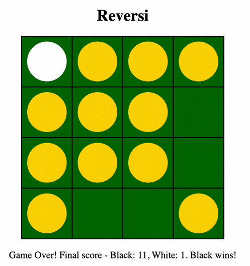

# Rules of Reversi



## The Board

The game is typically played on an 8x8 board, with pieces (tiles) that are black on one side and white on the other.  This implementation allows for 4x4, 6x6 and 10x10 boards as well.

## Setup
1. Each player chooses a color (black or white) and places two pieces of their color on the board in the center of the board, forming a square, like this:
   ```plaintext
     1 2 3 4 5 6 7 8
   1 . . . . . . . .
   2 . . . . . . . .
   3 . . . . . . . .
   4 . . . B W . . .
   5 . . . W B . . .
   6 . . . . . . . .
   7 . . . . . . . .
   8 . . . . . . . .
   ```

## Object of the Game

1. The object of the game is to have the most pieces of your color on the board at the end of the game.

## Gameplay

1. Players take turns placing their pieces on the board.  Black goes first.
1. A player can only place a piece in a position that will flip at least one of the opponent's pieces.
1. To flip an opponent's pieces, the player must place their piece in a position that is adjacent (vertically, horizontally, or diagonally) to an opponent's piece such that there is a straight line of opponent's pieces between the new piece and another piece of the player's color.
1. The player must flip all of the opponent's pieces that are in that line, and in all lines that are formed by the new piece.
1. The player can place their piece in any empty position on the board, as long as it flips at least one of the opponent's pieces.
1. If a player cannot make a valid move, they must pass their turn to the other player.

## Ending the Game

1. The game ends when the board is full or there are no valid moves left.  (If all the pieces on the board are the same color, there are no valid moves, and the game is over.)
1. The player with the most pieces on the board at the end of the game wins.
1. If both players have the same number of pieces, the game is a draw.
