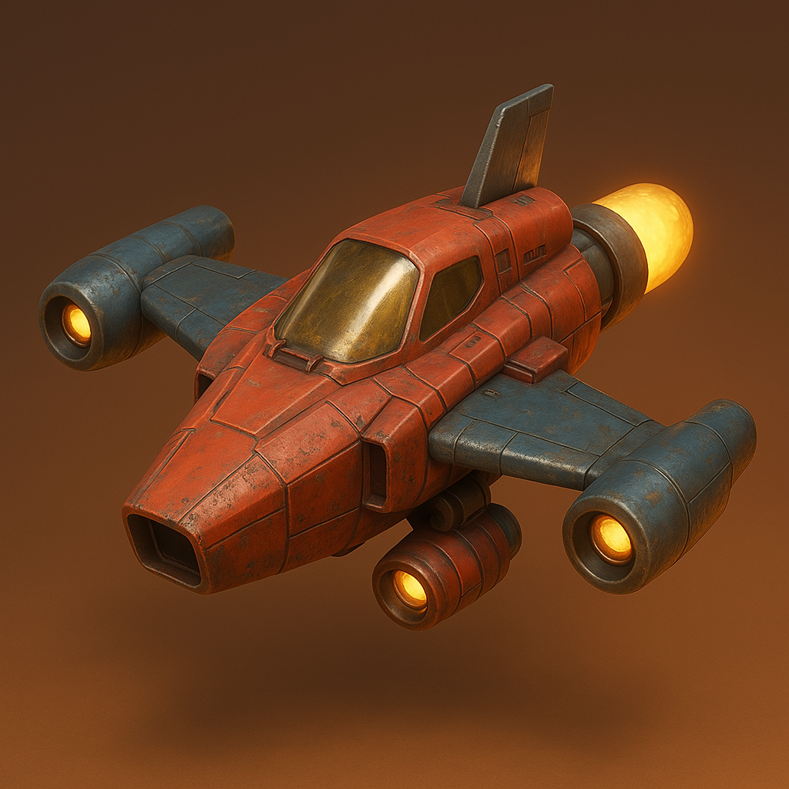
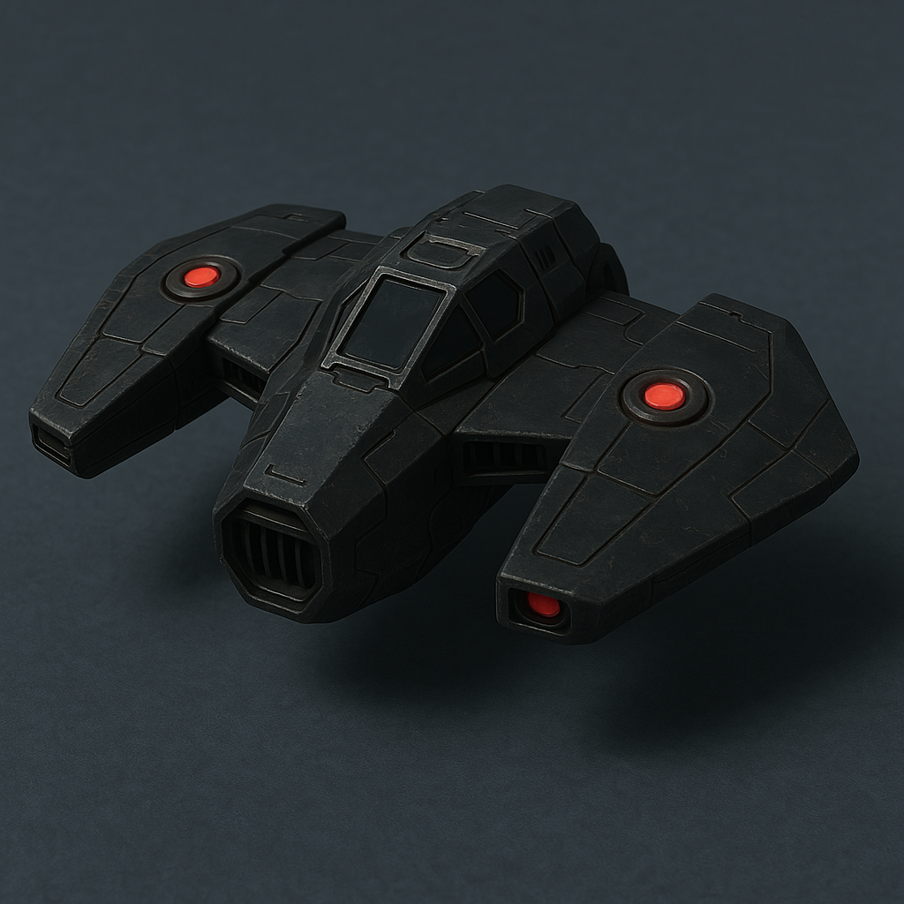

# Space Star: Last Chance

## Proceso de creación

- Crear un prompt incicial muy detallado de todas las características y detalles del juego.
- Usar meta-prompting para mejorar la calidad del prompt.
- Llevar el prompt a Cursor en modo Agent con selección de modelo Auto con un resultado bastante aceptable.
- Iterar con Cursor hasta conseguir el gameplay deseado.
- Generar la música con [Suno](https://suno.com/) y añadiéndola a los assets hace que funcione automáticamenten porque Cursor ya se había encargado.
- Los sonidos de efectos los he descargado de [Freesound](https://freesound.org/) y los he añadido a los assets. También se han aplicado automáticamente.
- Los fondos tanto para la pantalla de menu como el juego y las texturas del tunel las he creado con el nuevo generador de imágenes de ChatGPT.
- He creado unas imágenes de las naves con el generador de imágenes de ChatGPT y luego he creado los modelos texturizados con [Meshy](https://www.meshy.ai/).
- Los modelos si que he tenido que pedirle a Cursor que los incluyera sustituyendo los modelos poligonales que había anteriormente.

## Problemas enfrentados

La mayoría de los problemas enfrentados han sido referentes a bugs. La mayoría he podido solucionarlos con la ayuda de Cursor. Sin embargo, algunos problemas no pudieron ser resueltos a pesar de intentar darle más contexto o incluso apoyarme en imágenes.

- Los controles se vuelven mas inestables cuando se vuelve a empezar una partida.
- El túnel a veces tiene unos "gaps" cerca de la cámara.
- El sonido del menú no se reproduce al iniciar. Esto se debe a que los navegadores dehabilitan el sonido hasta que hay una interacción para mejorar la experiencia de usuario.

También encontré algunos problemas en la generación de imágenes de ChatGPT por alta demanda y tuve que esperar o cambiar la forma de realizar los prompts.

A pesar de toda la ayuda de la IA, tener el juego perfecto todavía requiere tiempo y refinado.

## Prompts

### Mi prompt inicial

Can you help me to improve this game creation prompt so I have not missed something and performs well for software development?

# Prompt for a space combat videogame 

I want you to develop a *space combat* game using **JavaScript, HTML, and CSS**, with the **Three JS** library, it must have an **index.html** file containing the main.js file as stated in [Three JS docs](https://threejs.org/manual/#en/installation) and importing the library from CDN. The latest version is 0.174.0  

## **Game Requirements:**
1. **Main Screen:**
   - The game title is "Space Star last chance"
   - There are 4 buttons so that the player can chose between:
      - **Start**: Starts the game.
      - **Controls**: Shows the controls screen.
      - **Ranking**: To see the current ranking.
   - On the top right corner, there is a button to **disable music but not fx**.
   - There is a **music playing** when you are in the menu unless player disables it.

2. **Game Screen:**  
   - There is a 3D **endless tunnel or corridor** having a "U" shape but with 90 degrees angles to conform the shape. It's a **one vanishing point** perspective.  
   - The floor and walls look like metal/carbon as in a **space station**. In fact, the player is hovering the tunnel of an space station.
   - The **background ceiling** is the **open space** having stars and a planet in the distance.
   - The player spaceship is view from **third-person view** perspective from behind.
   - The player spaceship can be controlled with the **keyboard arrows** to move the spaceship up, down, left and right.
   - The player spaceship can blast red lasers with the **space bar**.
   - On the top, a **shields** bar is shown with a percentage range **from 0 to 100 on the right of the bar**. Above the bar the word shields is shown. The bar and the percentage have a space indicator looking.
   - On the top right corner there are 2 indicators:
     - **Distance**: The distance that the player space ship has traveled starting from 0. 
     - **Speed**: Displays current speed starting from 10, being just a reference value not a real speed.
   - With the **initial speed 10**, the player spaceship travels **100m each second**.
   - Player spacehip can fire up to 3 blasts per second.
   - There are enemy spaceships coming from the background, so they **start being small** but **they get bigger as they approach** to the player spaceshift.
   - At the beginning, an enemy spaceship is spawn every 1000m.
   - Enemy spaceships blast green lasers.
   - The **player spaceship has a visual aim in front of it** so the player can calculate where the blasts are going to go.
   - The **visual aim moves and point where the front of the player spaceship looks at**.
   - The **visual aim engages an enemy** if it is very close to it.
   - The **visual aim disengages an enemy** if the player moves and the front of the spacehipo does not point or aim to that enemy.
   - A red blast from player spaceship destroys an enemy spaceship if the blast collides with the enemy, with an explosion.
   - Player space ship **can collide with the tunnel**.
   - Player space ship **can collide with enemy spaceships**.
   - Each **enemy blast decreases by 5** the player shields.
   - Each **collision decreases by 10** the player shields.
   - Each time the player spaceship collides or receives an enemy blast, **a light semi transparent red effect on the screen** will be shown.
   - If an **enemy spaceship reaches the player spaceship and goes beyond its plane**, it dissapears from the game.
   - Each **3000m the speed increases by 10**.
   - Each **3000m the enemy spawns every previousDistance-100m**.
   - The game **ends when player shields reach 0**.
   - When the game ends a popup is shown to player displaying:
     - **Distance**: The distance when the game ended.
     - **Speed**: The speed when the game ended.
     - **Enemies killed**: The number of enemies that the player killed.
     - An input to write their name.
     - An OK button that will save the **player name** and the **distance** in **localStorage**.
   - There is a **music playing** during the game unless player disabled it on the main menu. This song is different from the menu one.
   - Player can **return to main menu with the "esc" key**. He will be asked with a popup "Are you sure you want to quit? All the progress will be lost." having two buttons:
     - **Cancel**: to return to the game.
     - **Yes**: to go back to main menu screen.
   - **Sound effects**:  
     - A sound when a spacehip blasts.  
     - A sound for explosions of enemy spacehip.
     - A light sound when the player spaceship collides.
     - A sound when the game ends.    

3. **Ranking Screen:**  
   - Displays **the leaderboard**:
     - Ordered list showing *Player name* and *Distance*.  
     - Order is set by distance, **the higher the better**.
     - Shows the 10 best players.
   - Ranking data should be **stored in localStorage** and persist after closing the game.  

## **Interaction and Usability:**  
 
- **Smooth animations** when tiles move.  
- **Space aesthetic** All the screens and popup must have a **space wars** atmosphere and being consistent.

## **Delivery Format:**  
- Code should be structured in separate files:  
  - index.html (base structure).  
  - main.js (game logic using [ThreeJS imported using CDN](https://threejs.org/manual/#en/installation). The last version is 0.174.0).  
  - styles.css (design and retro styling).
  - assets/ (folder for images and sound effect).  
  - Code should be commented for clarity.  

Ask me if you have questions.

### Prompt mejorado de ChatGPT aplicado a Cursor

# Prompt for a Space Combat Video Game

Develop a **space combat video game** using **JavaScript, HTML, and CSS**, leveraging the **Three.js** library. Use version **0.174.0**, imported via **CDN** as shown in the [Three.js documentation](https://threejs.org/manual/#en/installation).

The code should be split into:
- `index.html` (HTML structure),
- `main.js` (game logic),
- `styles.css` (styling),
- `assets/` folder (for images, sounds, music),
- and include **inline comments** explaining key sections.

---

## 🌌 Game Overview

**Title:** *Space Star: Last Chance*  
Player navigates a spaceship through a 3D endless tunnel, avoiding and fighting enemy ships.

---

## 🎮 Game Screens & Functionality

### 1. **Main Menu Screen**
- Title displayed: **"Space Star: Last Chance"**
- Four buttons:
  - **Start**: Launches the game.
  - **Controls**: Shows control scheme (with keyboard keys listed).
  - **Ranking**: Displays the leaderboard.
  - **Toggle Music** (Top-right): Enables/disables menu background music (FX always stays enabled).
- Background music plays unless toggled off.

---

### 2. **Game Screen**

#### 🧭 Environment & Camera
- 3D **endless U-shaped tunnel** (right-angle turns).
- **Single-point perspective** for depth.
- Floor & walls: Metallic or carbon-textured (space station interior).
- Ceiling is **open to space**, showing **stars and a distant planet**.
- **Third-person camera**, positioned behind the spaceship, with slight movement based on player input.

#### 🚀 Player Controls
- Arrow keys: Move spaceship (Up/Down/Left/Right) within the tunnel.
- Spacebar: Fires **red lasers** (max 3 blasts/second).
- ESC: Opens quit confirmation dialog.

#### ⚔️ Combat and Gameplay
- Player spaceship has a **visible aim reticle** ahead of it:
  - Moves with the ship.
  - **Auto-locks** on enemies if they’re directly in front.
  - **Disengages** when not aligned.
- Enemy ships:
  - Approach from the distance (get larger as they near).
  - Fire **green lasers**.
  - Spawn every **1000m**, frequency increases every **3000m** (`spawnRate -= 100m`).
- Collisions:
  - Player can collide with tunnel or enemies.
  - Each enemy laser hit = **–5% shields**.
  - Collision = **–10% shields**.
  - Visual feedback: **semi-transparent red flash** overlay on damage.

#### 🧠 Game Logic & Stats
- **Shields bar** on top with:
  - Label: "Shields"
  - Value: 0–100%
  - Styled in sci-fi aesthetic
- **HUD** top-right:
  - Distance: Starts at 0m, increases based on speed.
  - Speed: Starts at 10 (reference unit only).
- Distance system:
  - 100m/sec at speed 10 (scale linearly).
  - Speed increases by +10 every **3000m**.
- **Enemies killed counter** tracked in-game.
- Enemy destroyed if laser collides → triggers explosion animation + SFX.
- Enemies that pass the player disappear.
- Game ends when **shields = 0**.

#### 🕹 Endgame Popup
- Displays:
  - Total Distance
  - Final Speed
  - Enemies Killed
  - Input: Player name
  - OK button: Saves name + distance in `localStorage`
- ESC behavior:
  - Shows modal: "Are you sure you want to quit? All progress will be lost."
  - Options: **Cancel / Yes (return to menu)**

#### 🔊 Audio
- Menu and gameplay music (2 different tracks).
- Music can be toggled ON/OFF (saved in session).
- FX (always enabled):
  - Player laser shot
  - Enemy explosion
  - Collision hit
  - Game Over tone

---

### 3. **Controls Screen**
- Clear layout of controls:
  - Arrow keys = Move
  - Space = Shoot
  - ESC = Pause / Quit to Menu

---

### 4. **Ranking Screen**
- Displays top 10 players (name + distance).
- Sorted by **highest distance**.
- Stored using `localStorage`, persistent across sessions.
- Clean UI styled in space-themed layout.

---

## 🎨 UI / UX / Styling
- Consistent **space aesthetic** across all screens and popups (inspired by sci-fi / space wars).
- Smooth **animations** for transitions, blasts, explosions, and movement.
- All popups and HUD elements follow a **cohesive visual language** (neon, minimal, futuristic).
- Mobile/tablet responsiveness is **not required**, but desktop-friendly layout is expected.

---

## 📦 Assets
Place images and audio in `assets/` folder. Include:
- Background textures (space, tunnel walls)
- Spaceship models/textures (if applicable)
- Sound effects
- Music tracks (can use placeholders for dev)

---

## ⚙️ Development Notes
- Use modular code structure when possible.
- Avoid large monolithic files.
- Include **code comments** to explain logic clearly.
- Optimize performance (e.g. reduce draw calls, remove offscreen objects).
- Can use placeholder assets/sounds where needed.

---

## ✅ Optional Enhancements (Nice to Have)
*These are NOT required, but you can implement if time/skill allows:*
- Particle system for explosions
- Shield recharge power-ups
- Difficulty modes (Easy / Normal / Hard)
- Level progression instead of endless mode
- 3D models for ships using GLTF or OBJ

### Prompts de imágenes en ChatGPT

Generate a 3d image of a main character spaceship in a stylized look for a 3d videogame

---

Now create a model for an enemy starship

---

Craate the main screen game with the player starship and several enemy starships

---

It’s perfect! Now I want you to create a sci-fi metal/carbon paneling texture for the space station where the video game takes place
